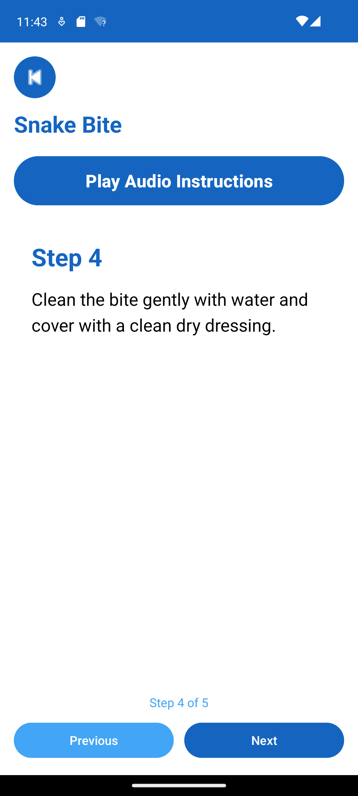
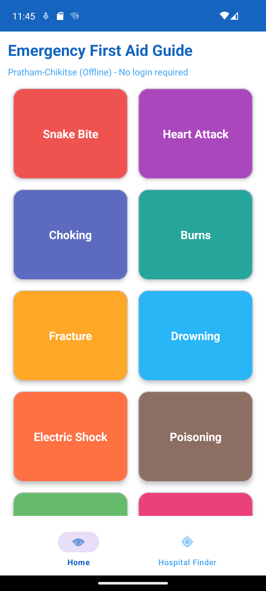
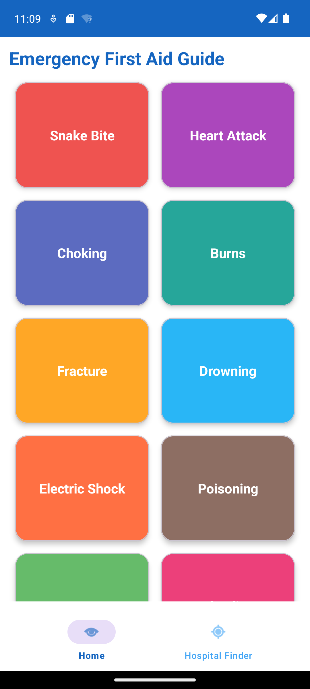

# Pratham-Chikitse (ಪ್ರಥಮ-ಚಿಕಿತ್ಸೆ)

**Pratham-Chikitse** is an offline-first Android emergency first-aid guide. It helps people act quickly during common medical emergencies when every second matters—especially in areas with limited connectivity, language barriers, or no immediate access to a doctor.

**Repository:** [https://github.com/Sindhu-S-Gowdar/PrathamChikitse](https://github.com/Sindhu-S-Gowdar/PrathamChikitse)

---

## Problem statement

During emergencies (snake bite, choking, burns, heart attack, and similar situations), panic and misinformation often lead to harmful actions—cutting a snake bite wound, applying ice to burns, or delaying a call to **108**. Many people lack a simple, trusted reference they can open instantly on their phone.

**Pratham-Chikitse** solves this by providing:

- **Step-by-step first-aid instructions** for 20 common emergencies, stored on the device (no login, no account).
- **Bilingual support** (English and Kannada) for wider reach in Karnataka and beyond.
- **Text-to-speech audio** so instructions can be heard hands-free.
- **A static hospital finder** with key Bengaluru hospitals and phone numbers for quick reference.
- **An AI symptom checker** (Google Gemini) that suggests the most likely emergency type and the first step to take—useful when the user is unsure which guide to open.

### Who it is for

- **General public** who want a pocket first-aid reference at home, school, or travel.
- **Students, community volunteers, and rural users** who need guidance in **English or Kannada**.
- **Anyone** preparing for emergencies where offline access to core guides matters (first-aid content works without internet; AI Check requires connectivity).

> **Medical disclaimer:** This app is an educational first-aid aid. It does not replace professional medical care. In serious emergencies, call **108** (or your local emergency number) immediately.

---

## Features

| Feature | Description |
|--------|-------------|
| **20 emergency guides** | Snake bite, heart attack, choking, burns, fracture, drowning, electric shock, poisoning, fever, bleeding, eye injury, allergic reaction, fainting, seizure, nosebleed, sprain, dog bite, head injury, asthma attack, diabetic emergency |
| **Offline first-aid content** | All guides, steps, do's, and don'ts are bundled in the app—usable without internet |
| **English & Kannada** | Language toggle on welcome and main screens; guides and UI update accordingly |
| **Step-by-step detail screens** | Numbered steps plus consolidated do's and don'ts for each emergency |
| **Play audio instructions** | Android Text-to-Speech reads steps and do's/don'ts aloud |
| **Hospital finder** | Static list of major Bengaluru hospitals with address and phone (Manipal, Aster CMI, Narayana Health City) |
| **AI symptom checker** | Describe symptoms; Gemini suggests one emergency from the fixed list, a first step, and when to call 108 |
| **No login required** | Open the app and use core features immediately |

### How to use the app

1. **Launch** — Open **Pratham-Chikitse**; on the welcome screen, tap the language button to switch between English and Kannada, then tap **Enter app**.
2. **Home** — Browse the colored emergency tiles. Tap any tile (e.g. **Snake Bite**) to open its detail screen.
3. **Emergency detail** — Read steps, do's, and don'ts. Tap **Play Audio Instructions** to hear them via TTS. Use **Back** to return to home.
4. **Hospital Finder** — Bottom navigation → **Hospital Finder** → view hospital name, address, and tap-to-call phone number.
5. **AI Check** — Bottom navigation → **AI Check** → type symptoms → **Check** → read the three-line suggestion (emergency type, first step, 108 reminder). Requires internet and a configured Gemini API key.

---

## Tech stack

| Layer | Technology |
|-------|------------|
| Language | Kotlin |
| UI | XML layouts, View Binding, Material Design Components |
| Architecture | Activities, Fragments, ViewModel, LiveData |
| Networking | Retrofit 2, OkHttp, Gson |
| AI | Google Gemini API (`generativelanguage.googleapis.com`) |
| Build | Gradle 8.x (Kotlin DSL), Android Gradle Plugin 8.12.3 |
| Min SDK | 24 (Android 7.0) |
| Target / compile SDK | 36 |

---

## Prerequisites

Before you install and run the project, ensure you have:

- **Android Studio** (Ladybug or newer recommended) with **Android SDK 36**
- **JDK 11 or higher** (JDK 17 is recommended for current Android Gradle Plugin)
- **Git** for cloning the repository
- A **Google Gemini API key** (only required for the **AI Check** tab; other features work without it)

---

## Installation

### 1. Clone the repository

```bash
git clone https://github.com/Sindhu-S-Gowdar/PrathamChikitse.git
cd PrathamChikitse
```

### 2. Configure the Gemini API key (for AI Check)

Create or edit `local.properties` in the project root (this file is **not** committed to Git):

```properties
sdk.dir=C\:\\Users\\YOUR_USERNAME\\AppData\\Local\\Android\\Sdk
GEMINI_API_KEY=your_gemini_api_key_here
```

Replace `sdk.dir` with your Android SDK path if Android Studio has not generated it yet.  
Obtain a key from [Google AI Studio](https://aistudio.google.com/apikey).

### 3. Open in Android Studio

1. Start **Android Studio** → **File** → **Open** → select the `PrathamChikitse` folder.
2. Wait for **Gradle sync** to finish.
3. If prompted, accept SDK licenses and install any missing SDK components.

---

## Run commands

### Run on emulator or device (Android Studio)

1. Connect a physical device with **USB debugging** enabled, or start an **Android Virtual Device (AVD)**.
2. Select the device in the toolbar.
3. Click **Run** (green play icon), or use **Run → Run 'app'**.

### Run from command line (Windows)

```powershell
cd PrathamChikitse
.\gradlew.bat assembleDebug
.\gradlew.bat installDebug
```

### Run from command line (macOS / Linux)

```bash
cd PrathamChikitse
./gradlew assembleDebug
./gradlew installDebug
```

### Build a release APK

```bash
.\gradlew.bat assembleRelease
```

Release APK output path:

`app/build/outputs/apk/release/app-release-unsigned.apk`

(Sign the APK before publishing to Play Store.)

### Run unit tests

```bash
.\gradlew.bat test
```

---

## Screenshots

Screenshots below are included in this repository and show the app running on an emulator.

### Welcome & home

| Welcome screen | Emergency home grid |
|----------------|---------------------|
|  |  |

### Emergency detail (Snake bite example)

| Detail – steps | Detail – do's / don'ts |
|----------------|------------------------|
|  |  |

| After navigation |
|------------------|
|  |

### App in use

| Running on emulator | Updated UI |
|---------------------|------------|
|  |  |

| Snake bite tile selected |
|--------------------------|
|  |

---

## Demo

There is no public web deployment for this Android app. You can demo it in two ways:

1. **Local demo (recommended)** — Follow [Installation](#installation) and [Run commands](#run-commands), then walk through Welcome → Home → an emergency guide → Hospital Finder → AI Check.
2. **Source & screenshots** — Browse this repository: [https://github.com/Sindhu-S-Gowdar/PrathamChikitse](https://github.com/Sindhu-S-Gowdar/PrathamChikitse) and the [Screenshots](#screenshots) section above for a visual walkthrough without building.

---

## Folder structure

```
PrathamChikitse/
├── app/
│   ├── build.gradle.kts          # App module build config, BuildConfig for API key
│   ├── src/main/
│   │   ├── AndroidManifest.xml
│   │   ├── java/com/example/prathamchikitse/
│   │   │   ├── MainActivity.kt           # Bottom nav: Home, Hospital, AI Check
│   │   │   ├── WelcomeActivity.kt        # Language selection & enter app
│   │   │   ├── data/
│   │   │   │   ├── model/                # EmergencyGuide, Hospital
│   │   │   │   ├── remote/               # Gemini API client & models
│   │   │   │   └── repository/           # FirstAidRepository (offline content)
│   │   │   ├── language/                 # English / Kannada manager
│   │   │   └── ui/
│   │   │       ├── home/                 # Emergency grid
│   │   │       ├── detail/               # Steps, do's, don'ts, TTS
│   │   │       ├── hospital/             # Hospital list
│   │   │       └── aicheck/              # Gemini symptom checker
│   │   └── res/                          # Layouts, strings, themes, drawables
│   └── src/test/                         # Unit tests
├── gradle/
│   └── libs.versions.toml                # Dependency versions catalog
├── build.gradle.kts                      # Root Gradle file
├── settings.gradle.kts
├── gradle.properties
├── local.properties                      # Local SDK path & GEMINI_API_KEY (gitignored)
├── gradlew / gradlew.bat
└── README.md
```

---

## Future improvements

- **Play Store release** with signed release builds and privacy policy for Gemini usage.
- **GPS-based hospital finder** using device location and maps instead of a static Bengaluru list.
- **More languages** (Hindi, Telugu, Tamil) using the existing language framework.
- **Offline AI fallback** or on-device model for symptom hints when internet is unavailable.
- **Emergency contact shortcuts** (108, 102 ambulance) as one-tap dial buttons.
- **Illustrations & videos** per emergency type for clearer visual learning.
- **Favorites / recent guides** for quick access to commonly needed emergencies.
- **Accessibility** improvements (larger text, high contrast, TalkBack tuning).
- **Automated tests** (UI tests with Espresso for critical flows).

---

## Author

**Sindhu S Gowdar** — [GitHub: Sindhu-S-Gowdar](https://github.com/Sindhu-S-Gowdar)

## License

This project is provided for educational and community health awareness purposes. Add an explicit open-source license file if you intend to allow reuse by others.
